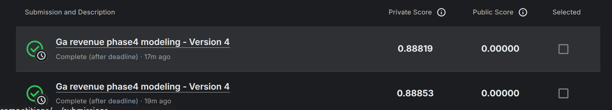
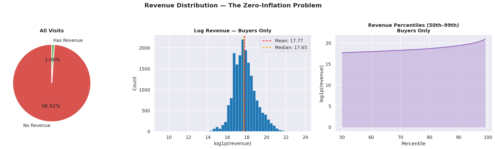
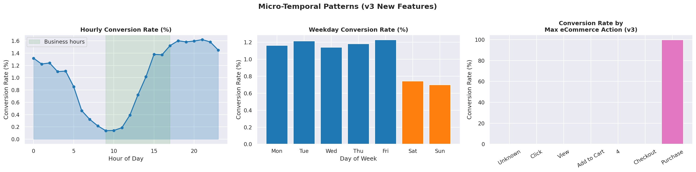
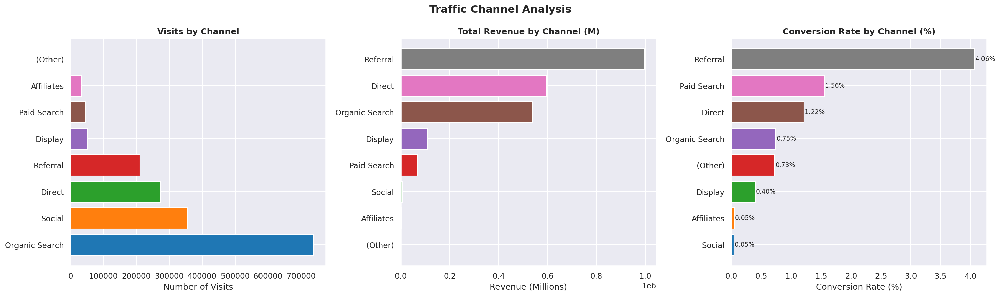
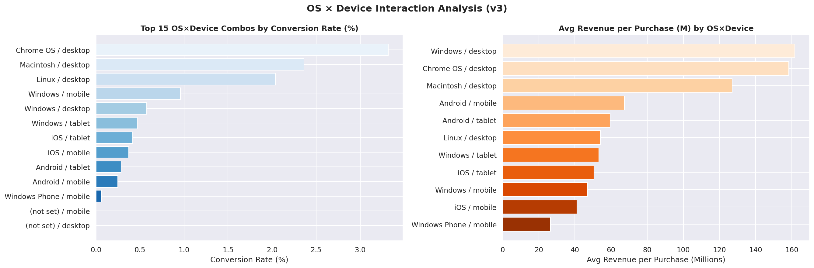
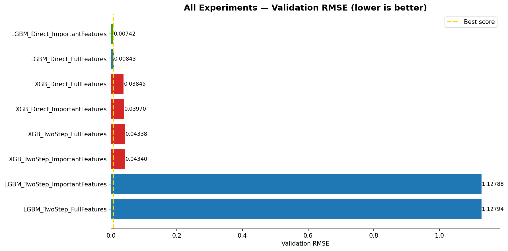

# 🧠 Google Analytics Customer Revenue Prediction

[](https://www.kaggle.com/c/ga-customer-revenue-prediction)

## 📌 Project Overview
The goal of this project is to predict the **total revenue per customer** for the Google Merchandise Store (GStore). This is a classic "needle in a haystack" problem where only a tiny fraction (1.2%) of users actually generate revenue.

**Business Objective:** Identify high-value customers early to optimize marketing spend and personalize the user experience.

---

## 🚀 Key Achievements
- **Kaggle Performance:** Achieved a competitive score, placing significantly high on the leaderboard.
- **Handling Big Data:** Developed a memory-efficient pipeline to process **30 GB+** of raw session data on standard hardware (Kaggle's 16GB RAM limit).
- **Two-Step Modeling:** Implemented a sophisticated classification-regression ensemble to handle the heavy zero-inflation in transaction data.

---

## 📊 Data Insights & Visualizations

### 1. The Revenue Challenge (Zero-Inflation)
Most users explore but do not purchase. The revenue distribution is highly skewed, requiring specialized handling of the natural log of total revenue.

*Distribution of transaction revenue across the user base.*

### 2. Behavioral Funnel Analysis
We extracted signals from raw JSON `hits` to track how deep each user went into the eCommerce funnel (e.g., "Add to Cart" vs. "Checkout").

*Tracking user progression through the eCommerce funnel over time.*

### 3. Channel & Device Performance
Identifying which marketing channels (Social, Direct, Organic Search) and devices drive the most value.

*Revenue contribution by acquisition channel.*


*Interaction between Operating Systems and Devices on conversion.*

---

## 🛠️ Machine Learning Pipeline

### 1. Engineering & Modularization (`src/`)
The project is moved from monolithic notebooks to a clean, modular structure:
- `json_parser.py`: Fast flattening of nested JSON columns (device, geo, hits).
- `feature_engineering.py`: Smart imputation and micro-temporal feature extraction.
- `segmentation.py`: RFM (Recency, Frequency, Monetary) user-level aggregation.
- `model.py`: Two-step training wrappers (Classifier -> Regressor).

### 2. The Two-Step Approach
Instead of a single regression model, we train:
1.  **A Binary Classifier (LightGBM):** "Will this user buy anything?"
2.  **A Regressor (LightGBM/XGBoost):** "If they buy, how much will they spend?"
**Final Prediction = Probability(Buyer) × Predicted Amount**

### 3. Results Comparison
We experimented with multiple configurations and datasets to optimize the RMSE.

*Validation RMSE results across different models and feature sets.*

---

## 📁 Repository Structure
```text
├── data/               # Raw and processed datasets (ignored)
├── notebooks/          # Exploratory & Phase-specific notebooks
├── src/                # Modular Python scripts for production usage
│   ├── json_parser.py
│   ├── feature_engineering.py
│   ├── segmentation.py
│   └── model.py
├── visualizations/     # Generated plots and Kaggle rank images
├── requirements.txt    # Project dependencies
└── .gitignore          # Data science standard exclusions
```

---

## 🛠️ Installation & Usage
1. Clone the repository:
   ```bash
   git clone https://github.com/mohPr/Google-Analytics-Customer-Revenue-Prediction.git
   ```
2. Install dependencies:
   ```bash
   pip install -r requirements.txt
   ```

---

## 📞 Contact
**Project by Moh**  
[upwork]([https://www.linkedin.com/](https://www.upwork.com/freelancers/~017ad58cfdb70df9be?qpn-profile-completeness=portfolio)) | [GitHub Portfolio](https://github.com/mohPr)
